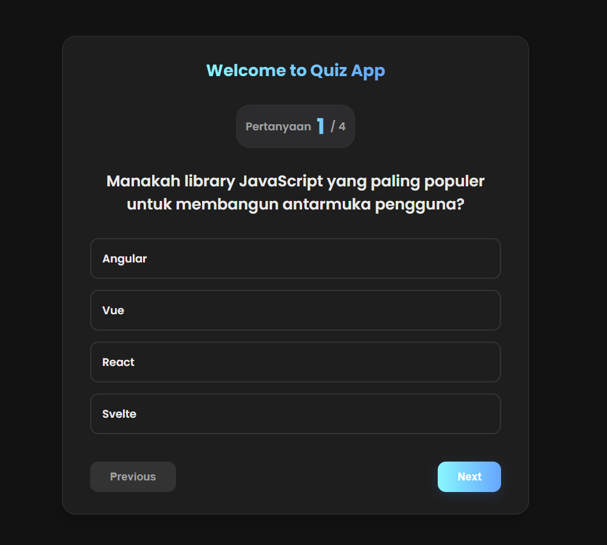

# Quiz App React

Aplikasi kuis sederhana yang dibangun menggunakan **React** dan **Vite**. Proyek ini menampilkan antarmuka pengguna yang modern dan interaktif dengan tema gelap, serta didukung oleh state management yang efisien menggunakan *custom hook*.



---

## ✨ Fitur Utama

-   **Tumpukan Teknologi Modern**: Dibangun dengan React + Vite untuk pengalaman pengembangan yang super cepat.
-   **Styling Terisolasi**: Menggunakan CSS Modules untuk memastikan gaya setiap komponen tidak tumpang tindih dan mudah dikelola.
-   **Tema Gelap Elegan**: Antarmuka pengguna (UI) dengan tema gelap yang menarik secara visual dan nyaman di mata.
-   **Elemen Interaktif**: Efek transisi, *hover*, dan gradien yang halus untuk meningkatkan pengalaman pengguna.
-   **Logika Terpusat**: Semua logika kuis dikelola oleh sebuah *custom hook* (`QuizHandler`) yang membuat komponen tetap bersih dan fokus pada tampilan.
-   **Struktur Berbasis Komponen**: Kode diorganisir ke dalam komponen-komponen yang bersih dan dapat digunakan kembali.

---

## 🚀 Teknologi yang Digunakan

-   **[React](https://react.dev/)**: Library JavaScript untuk membangun antarmuka pengguna.
-   **[Vite](https://vitejs.dev/)**: *Build tool* generasi baru yang memberikan pengalaman pengembangan super cepat.
-   **[CSS Modules](https://github.com/css-modules/css-modules)**: Untuk styling komponen yang terisolasi dan dapat diskalakan.

---

## 📂 Struktur Proyek

Berikut adalah gambaran struktur folder dan file penting dalam proyek ini:
```
quiz-app/
├── public/
├── src/
│   ├── components/
│   │   ├── QuestionCard.jsx          # Komponen untuk menampilkan kartu pertanyaan
│   │   ├── QuestionCard.module.css
│   │   ├── ResultScreen.jsx          # Komponen untuk menampilkan layar hasil
│   │   └── ResultScreen.module.css
│   ├── data/
│   │   └── questions.js              # Data statis berisi semua pertanyaan kuis
│   ├── hooks/
│   │   └── QuizHandler.js            # Custom hook yang mengelola semua logika kuis
│   ├── App.jsx                       # Komponen utama aplikasi
│   ├── App.module.css
│   ├── index.css                     # Gaya global dan variabel CSS (tema)
│   └── main.jsx                      # Titik masuk aplikasi React
├── .gitignore
├── index.html
└── package.json
```
---

## 🔧 Dokumentasi Kode

### 1. `QuizHandler.js` (Custom Hook)

Ini adalah otak dari aplikasi. *Hook* ini bertanggung jawab untuk mengelola semua *state* dan fungsi yang berkaitan dengan alur kuis. Dengan memisahkan logika ke dalam *hook* ini, komponen `App.jsx` menjadi jauh lebih bersih.

-   **State yang Dikelola:**
    -   `current`: Menyimpan indeks pertanyaan yang sedang ditampilkan.
    -   `score`: Sebuah *array* yang menyimpan skor untuk setiap pertanyaan (nilai `point` jika benar, `0` jika salah).
    -   `finish`: *Boolean* yang menandakan apakah kuis telah selesai.
    -   `answers`: Sebuah *array* yang menyimpan indeks jawaban yang dipilih pengguna untuk setiap pertanyaan.

-   **Fungsi yang Diekspos:**
    -   `HandleNext()`: Pindah ke pertanyaan berikutnya.
    -   `HandlePrev()`: Kembali ke pertanyaan sebelumnya.
    -   `ChooseHandler(isCorrect, point)`: Mencatat skor berdasarkan jawaban yang dipilih.
    -   `AnswerHandler(indexOption)`: Mencatat pilihan jawaban pengguna untuk menyorot opsi yang dipilih.
    -   `FinishHandler()`: Mengakhiri kuis dan menghitung total skor.
    -   `RepeatHandler()`: Mengatur ulang semua *state* untuk memulai kuis dari awal.

### 2. Komponen Utama

#### `App.jsx`

Komponen ini berfungsi sebagai "container" utama. Ia memanggil *hook* `QuizHandler` untuk mendapatkan semua data dan fungsi, lalu menampilkannya ke komponen anak.

-   **Tugas Utama:**
    -   Memanggil `QuizHandler()` untuk mendapatkan *state* dan *handler*.
    -   Melakukan render kondisional:
        -   Menampilkan `<QuestionCard />` jika kuis sedang berlangsung (`finish` adalah `false`).
        -   Menampilkan `<ResultScreen />` jika kuis sudah selesai (`finish` adalah `true`).
    -   Meneruskan semua *props* yang relevan ke `QuestionCard` dan `ResultScreen`.

#### `QuestionCard.jsx`

Komponen presentasional yang murni bertugas menampilkan UI untuk sebuah pertanyaan. Komponen ini tidak memiliki logika internal dan sepenuhnya dikendalikan oleh *props* dari `App.jsx`.

-   **Props yang Diterima:**
    -   `question`: Objek berisi teks pertanyaan dan pilihan jawaban.
    -   `currentQuestionNumber`, `totalQuestion`: Untuk menampilkan penanda "Pertanyaan X / Y".
    -   `nextHandler`, `prevHandler`, `finishHandler`, dll.: Fungsi-fungsi dari *hook* `QuizHandler` yang dihubungkan ke tombol dan pilihan jawaban.

#### `ResultScreen.jsx`

Komponen presentasional sederhana untuk menampilkan hasil akhir kuis.

-   **Props yang Diterima:**
    -   `correctQuestionNumber`: Jumlah jawaban benar.
    -   `totalQuestion`: Total pertanyaan.
    -   `resultScore`: Fungsi untuk menghitung dan menampilkan skor akhir.
    -   `repeatQuizHandler`: Fungsi untuk dihubungkan ke tombol "Ulangi Kuis".

### 3. Styling (`.css` dan `.module.css`)

-   **`index.css`**: Mendefinisikan variabel CSS global (`:root`) untuk tema warna gelap, serta menerapkan gaya dasar pada `body` seperti jenis font.
-   **CSS Modules**: Setiap komponen memiliki file `.module.css` sendiri. Ini memastikan bahwa nama kelas seperti `.button` di `QuestionCard.module.css` tidak akan bentrok dengan `.button` di `ResultScreen.module.css`.

---

## ⚙️ Menjalankan Proyek Secara Lokal

Untuk menjalankan proyek ini di komputer Anda, ikuti langkah-langkah berikut:

1.  **Clone repositori ini**
    ```bash
    git clone [https://github.com/NAMA_USER_ANDA/NAMA_REPO_ANDA.git](https://github.com/NAMA_USER_ANDA/NAMA_REPO_ANDA.git)
    ```

2.  **Masuk ke direktori proyek**
    ```bash
    cd NAMA_REPO_ANDA
    ```

3.  **Install semua dependensi**
    ```bash
    npm install
    ```

4.  **Jalankan server development**
    ```bash
    npm run dev
    ```
    Aplikasi akan tersedia di `http://localhost:5173` (atau port lain yang tersedia).

---

## 📜 Skrip yang Tersedia

Dalam proyek ini, Anda dapat menjalankan beberapa skrip:

-   **`npm run dev`**: Menjalankan aplikasi dalam mode pengembangan.
-   **`npm run build`**: Mem-bundle aplikasi ke dalam file statis untuk production di dalam folder `dist`.
-   **`npm run lint`**: Menjalankan ESLint untuk memeriksa masalah pada kode.
-   **`npm run preview`**: Menjalankan server lokal untuk melihat hasil build dari folder `dist`.